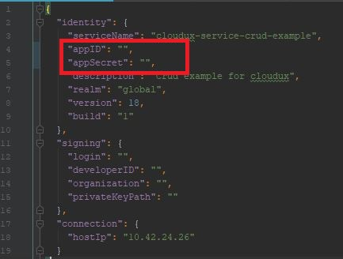

# CloudUX Service CRUD Example

Welcome to CloudUX Service CRUD Example! 

## Getting started
To use this application you will need following tools:
1. running **MediaCentral | Cloud UX 2018.6** machine
2. [node.js and npm](https://nodejs.org)
3. [proxy ball](https://my.avid.com/cpp/sdk/apc) for more information check FAQ

This project has been generated by [cloudux-starter-kit-service](https://www.npmjs.com/package/cloudux-starter-kit-service).

Before you will lunch your application you may need to change proxy Setup and change 
[hostIp](https://burl-gitlab.global.avidww.com/lstefano/cloudux-service-crud-example/blob/master/project.config.json) 
to point your machine with 
working MediaCentral | Cloud UX 2018.6

In project's root directory you can find [project.config.json](https://burl-gitlab.global.avidww.com/lstefano/cloudux-service-crud-example/blob/master/project.config.json) 
file, where you can change your project settings.

To connect with the ACS Monitor you need a proxy bal. (link is above)
You will also need application id and application secret. Please paste them into project.config.json 
file. They are defined as you can see below:

After installing proxy ball and implementing app id and app secret please use npm install to build an environment. 
Type path to proxy-bal.tar file as an argument. When finished type npm start.

To make function visible in ACS Monitor you need to define it in config/service.ops.config.json file. With every change
in that file you need to increment service version. You can do it in project.config.json. Otherwise the changes will not
be loaded.

Here is the example of a proper function definition in
[service.ops.config.json](https://burl-gitlab.global.avidww.com/lstefano/cloudux-service-crud-example/blob/master/config/service.ops.config.json). 
Please remember to specify HTTP method you want to use.

This service is an example which will help newcomers to understand how to communicate between services. 
After running the project please check if it is visible in ACS Monitor (http://yourMediacentralIP:30800/acs.html) on 
you machine.
If everything went fine you would see the cloudux-service-crud example and all available service operations.

The picture below depicts the responsibilities of each object property defined in service.ops.config.json file.

All of the functions are defined in src/service.js file. 
At the beginning we need to create service instance with bal access.

Now we need to implement functions, which will allow us to communicate with attributes service.
At the beginning of the each of them we define how our message will look like. They are similar in all of the functions.
Delete method is an exception, we define there the array of names to be able delete more than one object at once.
We also define attributes function we want to use. In case of our getDataFromAttributes it's 'fetch'.
After calling a function we return an error or result.

Our postDataToAttributes function calls 'store' from attributes service. All the mechanism has not changed.

In deleteDataFromAttributes we call 'delete' function from attributes.

Attributes service does not contain update function. We implemented it by using 'fetch' (the same function that we used 
in getDataFromAttributes) calling post if we did not receive an error message.

We implemented connection mechanism in index.js file.

